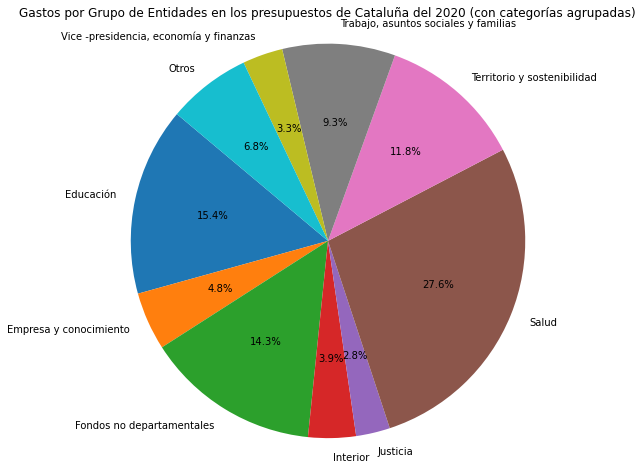
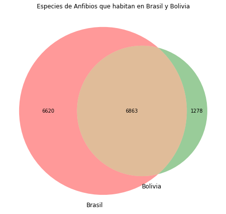
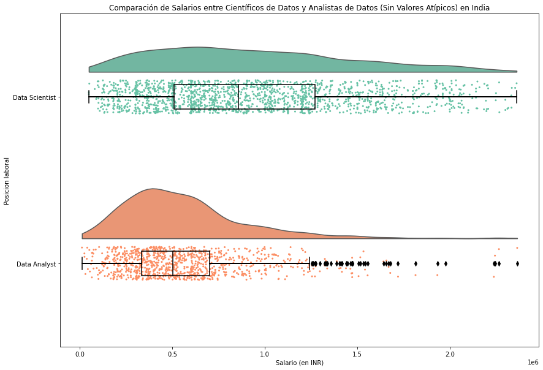

```python
# %%
import seaborn as sns
import matplotlib.pyplot as plt
from googletrans import Translator
import pandas as pd
from matplotlib_venn import venn2
import seaborn as sns
import matplotlib.pyplot as plt
import numpy as np
from matplotlib import gridspec
import ptitprince as pt


```


```python

# Inicializar el traductor
translator = Translator()

# Cargamos el dataset de iris
df_presuposts=pd.read_csv("Pressupostos_aprovats_de_la_Generalitat_de_Catalunya_20231105.csv")

# Filtrar los datos para el ejercicio de 2020 y la columna 'Ingrés / Despesa' para 'D' (Despesas/Gastos)
df_2020 = df_presuposts[(df_presuposts['Exercici'] == 2020) & (df_presuposts['Ingrés / Despesa'] == 'D')]

# Agrupar por 'Nom Agrupació' y sumar los 'Import Consolidat Sector Públic'
gastos_por_grupo = df_2020.groupby('Nom Agrupació')['Import Consolidat Sector Públic'].sum()

# Definir un umbral para el tamaño mínimo de las categorías para mostrar individualmente
umbral = gastos_por_grupo.sum() * 0.025  # Por ejemplo, el 5% del total

# Crear una serie donde todo lo que está por debajo del umbral se suma en la categoría 'Otros'
otros = gastos_por_grupo[gastos_por_grupo < umbral].sum()
gastos_agrupados = gastos_por_grupo[gastos_por_grupo >= umbral]
gastos_agrupados['Otros'] = otros  # Agregar la categoría 'Otros'

# Suponer que tenemos una lista de strings en catalán
nombres_en_catalan = gastos_agrupados.index.tolist()

# Traducir cada nombre usando Google Translate
nombres_traducidos = [translator.translate(nombre, src='ca', dest='es').text for nombre in nombres_en_catalan]

# Crear el pie chart con las categorías agrupadas
plt.figure(figsize=(10, 8), facecolor='white')
plt.pie(gastos_agrupados, labels=nombres_traducidos, autopct='%1.1f%%', startangle=140)
plt.axis('equal')  # Para que el pie chart sea circular
plt.title('Gastos por Grupo de Entidades en los presupuestos de Cataluña del 2020 (con categorías agrupadas)')
plt.show()
```





```python

# Cargamos el dataset de crecimiento de plantas
df_animales=pd.read_csv("Species_Database_wb_datanam.csv")
# Agrupamos los datos por la columna 'binomial' y luego extraemos una lista de países para cada grupo
species_countries = df_animales.groupby('binomial')['wb_datanam'].apply(list).to_dict()

# Filtramos las especies que se encuentran en Brasil o Bolivia
brazil_species = set(df_animales[df_animales['wb_datanam'] == 'Brazil']['binomial'])
bolivia_species = set(df_animales[df_animales['wb_datanam'] == 'Bolivia']['binomial'])
plt.figure(figsize=(8, 8), facecolor='white')
venn2([brazil_species, bolivia_species], ('Brasil', 'Bolivia'))
plt.title("Especies de Anfibios que habitan en Brasil y Bolivia")
plt.show()

```

    c:\Users\joelg\anaconda3\lib\site-packages\IPython\core\interactiveshell.py:3071: DtypeWarning: Columns (3,4) have mixed types.Specify dtype option on import or set low_memory=False.
      has_raised = await self.run_ast_nodes(code_ast.body, cell_name,
    





```python


df_salary=pd.read_csv("salary\Partially Cleaned Salary Dataset.csv")
# Filtramos solo los datos de 'Data Scientist' y 'Data Analyst'
relevant_jobs = df_salary[df_salary['Job Title'].isin(['Data Scientist', 'Data Analyst'])]

# Calculamos el IQR
Q1 = relevant_jobs['Salary'].quantile(0.25)
Q3 = relevant_jobs['Salary'].quantile(0.75)
IQR = Q3 - Q1

# Definimos los límites para los outliers
lower_bound = Q1 - 1.5 * IQR
upper_bound = Q3 + 1.5 * IQR

# Filtramos los outliers
filtered_jobs = relevant_jobs[(relevant_jobs['Salary'] >= lower_bound) & (relevant_jobs['Salary'] <= upper_bound)]


#adding the boxplot with quartiles
f, ax = plt.subplots(figsize=(14, 10))
ort="h"; pal = "Set2"

ax=pt.half_violinplot( x = filtered_jobs["Salary"], y = filtered_jobs["Job Title"], data = filtered_jobs[["Job Title","Salary"]], palette = pal, bw = .2, cut = 0.,
                      scale = "area", width = .6, inner = None, orient = ort)
ax=sns.stripplot( x = filtered_jobs["Salary"], y = filtered_jobs["Job Title"], data = filtered_jobs[["Job Title","Salary"]], palette = pal, edgecolor = "white",
                 size = 3, jitter = 1, zorder = 0, orient = ort, ax = ax )
ax=sns.boxplot( x = filtered_jobs["Salary"], y = filtered_jobs["Job Title"], data = filtered_jobs[["Job Title","Salary"]], color = "black", width = .15, zorder = 10,\
            showcaps = True, boxprops = {'facecolor':'none', "zorder":10},\
            showfliers=True, whiskerprops = {'linewidth':2, "zorder":10},\
               saturation = 1, orient = ort)
ax.set_xlabel('Salario (en INR)')
ax.set_ylabel('Posicion laboral')
plt.title("Comparación de Salarios entre Científicos de Datos y Analistas de Datos (Sin Valores Atípicos) en India")


```


    Text(0.5, 1.0, 'Comparación de Salarios entre Científicos de Datos y Analistas de Datos (Sin Valores Atípicos) en India')





```python

```
